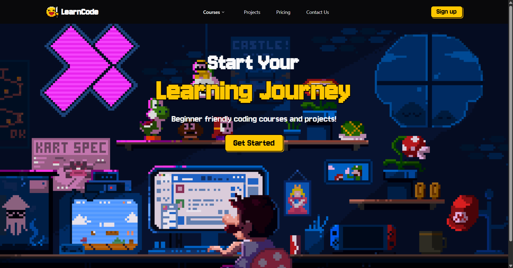
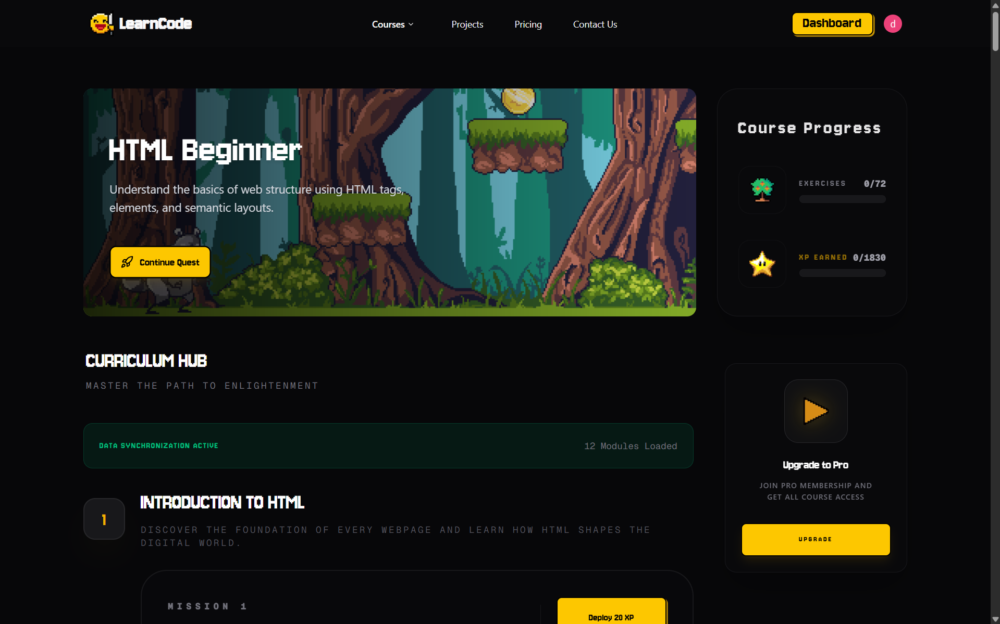
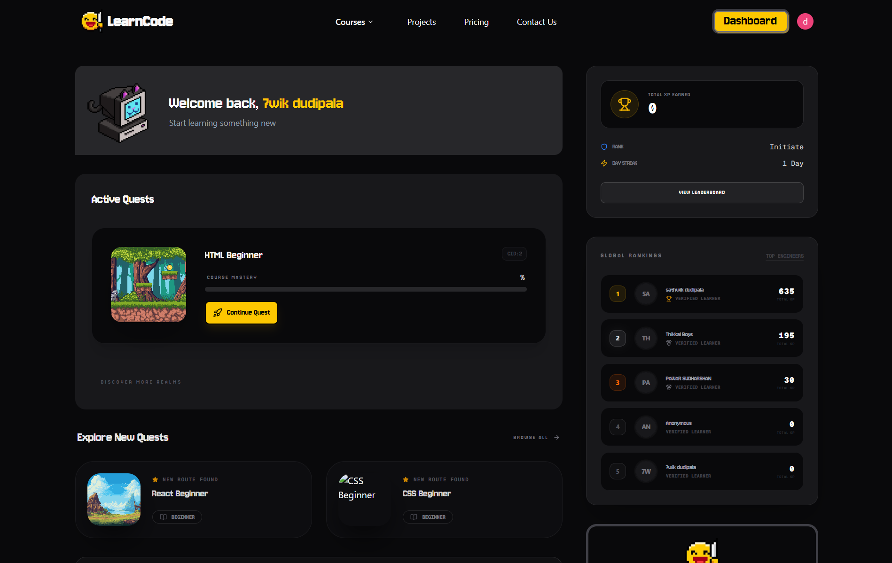

# LearnCode

LearnCode is a modern, interactive web-based learning platform optimized for discovering, managing, and engaging with coding courses.

🚀 **Live Deployment:** [https://learncode-lac.vercel.app](https://learncode-lac.vercel.app)







## Features

- **Authentication**: Secure sign-up and login powered by [Clerk](https://clerk.com/).
- **Discover & Enroll**: Browse an expanding catalog of coding courses and dive into detailed, dynamic course syllabuses.
- **Interactive Workspace**: A premium course viewing experience featuring resizable panels (`react-resizable-panels`) to fit lesson materials comfortably seamlessly alongside interactive elements.
- **Progress Tracking**: Personal user dashboard to monitor access to ongoing and completed programs.
- **Pro Upgrades**: Integrated checkout flow using [Stripe](https://stripe.com/) for unlocking premium paths.

## Tech Stack

- **Framework**: [Next.js 16](https://nextjs.org/) (React 19)
- **Styling**: Tailwind CSS v4 & [Shadcn UI](https://ui.shadcn.com/)
- **Database**: Serverless PostgreSQL via [Neon](https://neon.tech/) + [Drizzle ORM](https://orm.drizzle.team/)
- **Payments**: Stripe Checkout
- **Tools**: React Hook Form, Zod, Sonner (Toasts)

## 📚 Full Documentation

The full documentation for this project—including deeper architectural notes, deployment strategies, and API details—is available locally. 

**Please check the `public/docs` folder in this repository for the complete documentation.**

## Getting Started

1. **Clone the repository** and navigate into it.
2. **Setup environment variables** (`.env.local`): You will need API keys for Clerk, Stripe, and your Neon database URL.
3. **Install dependencies**:
   ```bash
   npm install
   ```
4. **Run the development server**:
   ```bash
   npm run dev
   ```

Visit `http://localhost:3000` to see the application running.
